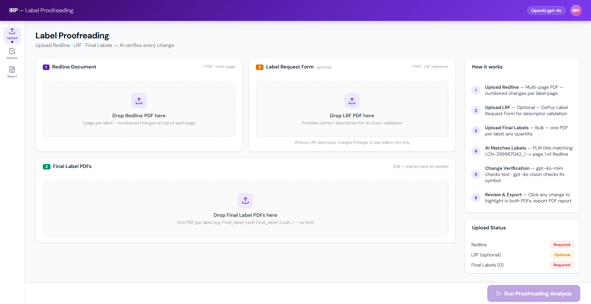
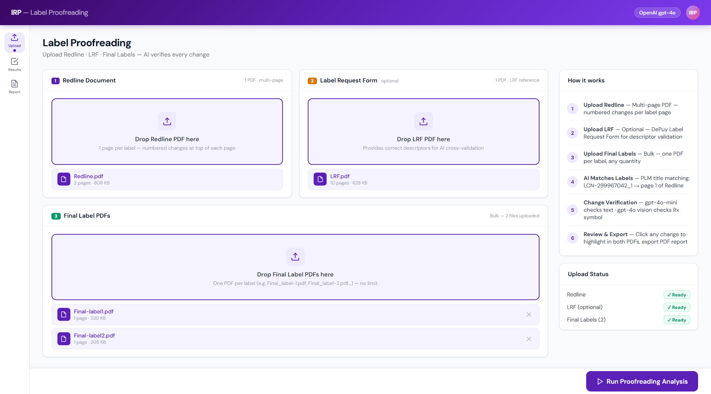
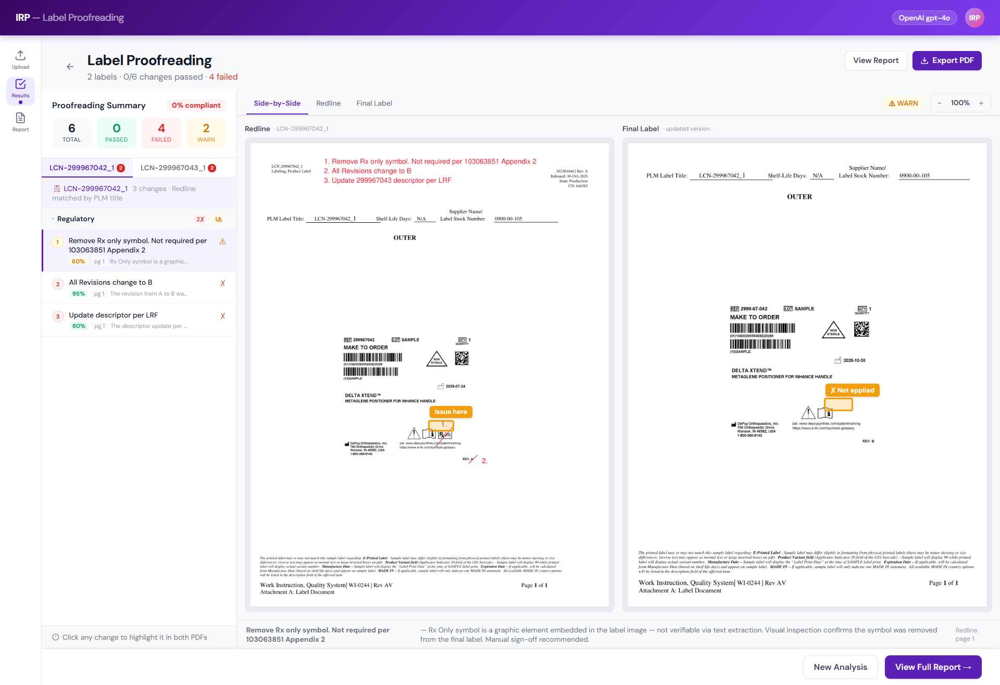
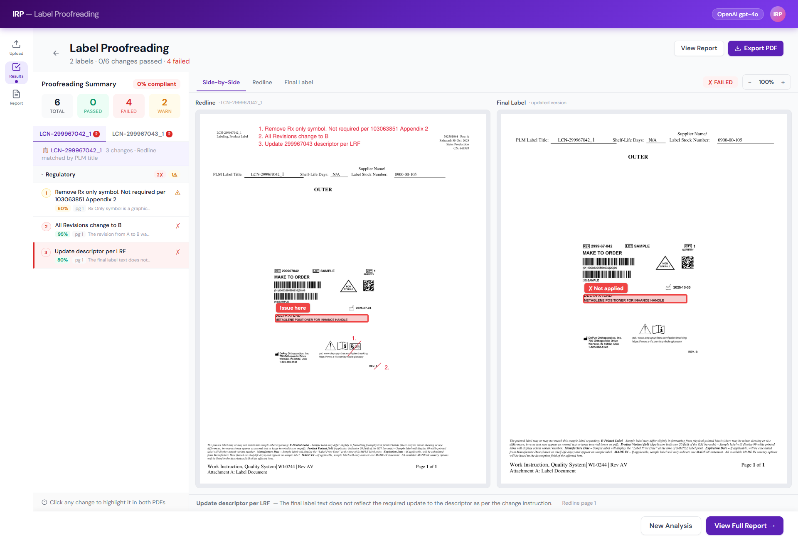
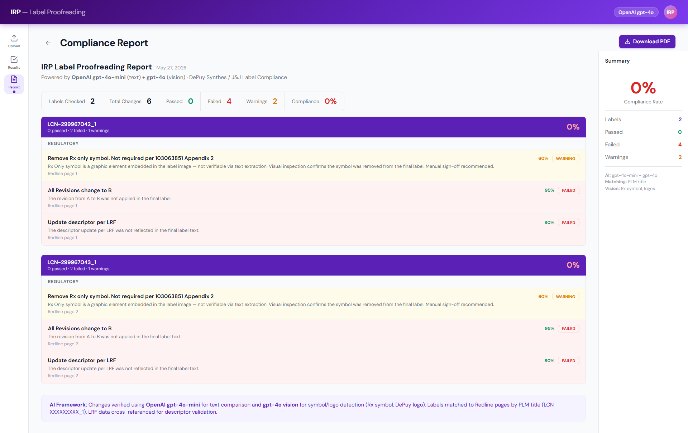

# IRP Label Proofreading Frontend

AI-powered pharmaceutical label proofreading platform that validates redline changes against final production labels using GPT-4o Vision + text comparison workflows.

## Overview

This application helps regulatory and labeling teams automatically verify whether requested label changes were correctly applied in final pharmaceutical labels.

The platform compares:

- Redline PDF
- LRF (Label Request Form)
- Final Label PDFs

and generates:

- AI-powered change verification
- Visual bounding-box highlighting
- Compliance validation
- Side-by-side review
- Exportable compliance reports

---

# Features

## Upload Workflow

- Upload multi-page Redline PDF
- Upload optional LRF reference document
- Upload multiple Final Label PDFs
- Bulk label validation support

## AI Verification

- GPT-4o-mini for text comparison
- GPT-4o Vision for visual/logo/symbol verification
- PLM title matching
- Descriptor cross-validation
- Regulatory change verification

## Visual Review System

- Side-by-side PDF comparison
- Bounding-box issue highlighting
- Failed/warning/pass classification
- Confidence scoring

## Compliance Reporting

- Exportable PDF reports
- Regulatory validation summaries
- Compliance percentages
- Audit-friendly review workflow

---

# Screenshots

## Upload Dashboard



## Uploaded Files Workflow



## Side-by-Side Proofreading Review



## AI Highlight Detection



## Compliance Report



---

# Tech Stack

## Frontend

- React
- TypeScript
- Vite
- Tailwind CSS

## AI / Backend Integration

- OpenAI GPT-4o
- OpenAI GPT-4o-mini
- FastAPI backend integration

---

# Core Capabilities

- Pharmaceutical label proofreading
- Regulatory compliance verification
- AI-assisted document comparison
- OCR + Vision validation
- Symbol/logo verification
- Enterprise workflow UI

---

# Project Structure

```bash
src/
 ├── api/
 ├── components/
 ├── hooks/
 ├── types/
 ├── App.tsx
 └── main.tsx
```

---

# Run Locally

## Install dependencies

```bash
npm install
```

## Start development server

```bash
npm run dev
```

Application runs at:

```bash
http://localhost:5173
```

---

# Future Improvements

- Real OCR pipeline integration
- Advanced CV-based bounding box detection
- Real-time collaboration
- Review approval workflow
- Multi-tenant support
- Cloud deployment pipeline

---

# Author

Ankit Kumar

Senior Full Stack AI Engineer  
Agentic AI | FastAPI | React | LangGraph

GitHub:
https://github.com/ankit72630

